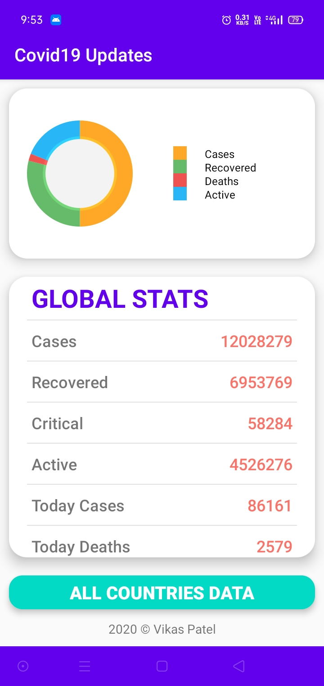
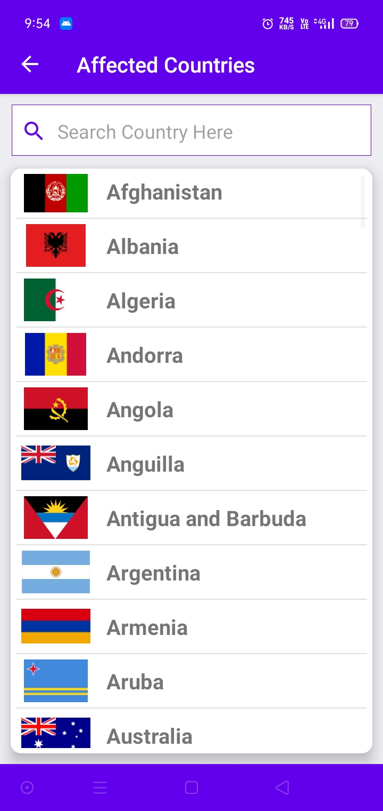
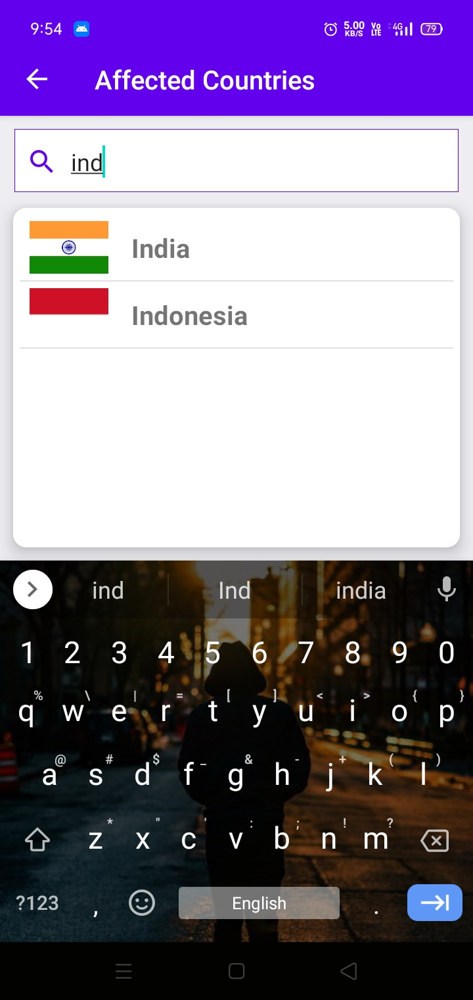
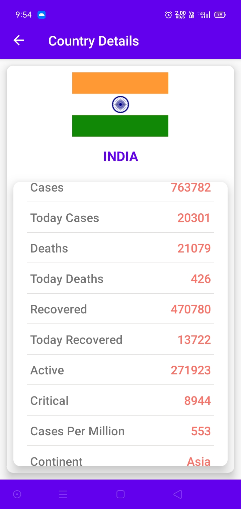

# covid19updates   
Android application for tracking worldwide covid19 cases.

The application refreshes every 10 minutes.

# Download 

Check the release folder for latest releases.

**[Click Here](https://github.com/vikaspatelp83/covid19updates/tree/master/release)**

##### OR  
1. Go to release section of the repository **[from here](https://github.com/vikaspatelp83/covid19updates/releases)**. 
2. Download the `zip/tar.gz`.   
3. Extract the  `zip/tar.gz` and install `covid19-Updates.apk` on your phone.

##### OR
Click the link below   
**[DOWNLOAD](https://github.com/vikaspatelp83/covid19updates/raw/master/release/v1.0/Covid19-Updates-v1.0.apk)**

# Api
I've used the following api   
`CORONA.LMAO.NINJA`

# App Screenshots

## Home 

## Country List 

## Search Country 

## Country Details 

